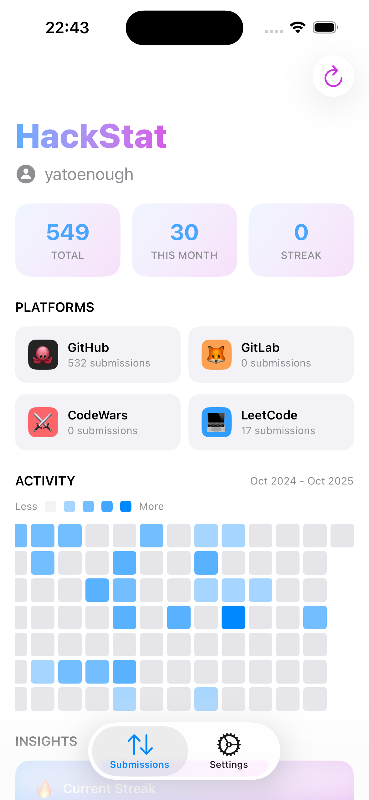

# HackStat

<div align="center">
  
  
</div>
<br>

A unified iOS app for tracking your coding activity and maintaining streaks across multiple platforms.
HackStat brings together your coding statistics from GitHub, Codewars, and other platforms into a single, beautiful interface. Track your progress, maintain your streaks, and stay motivated with comprehensive visual streak graphs.

### Currently supported platforms
- GitHub
- GitLab
- LeetCode
- CodeWars

## Build and run

- Open the project in Xcode
- Select your development team in the project settings
- Create a ```Credentials``` struct like in ```HackStat/App/Credentials.example.swift``` and insert your API key
- Use the app

## Roadmap
- [X] Core app features 
- [ ] Support for more platforms
- [ ] Widget support
- [ ] Custom streak goals and notifications
- [ ] Publish to AppStore
